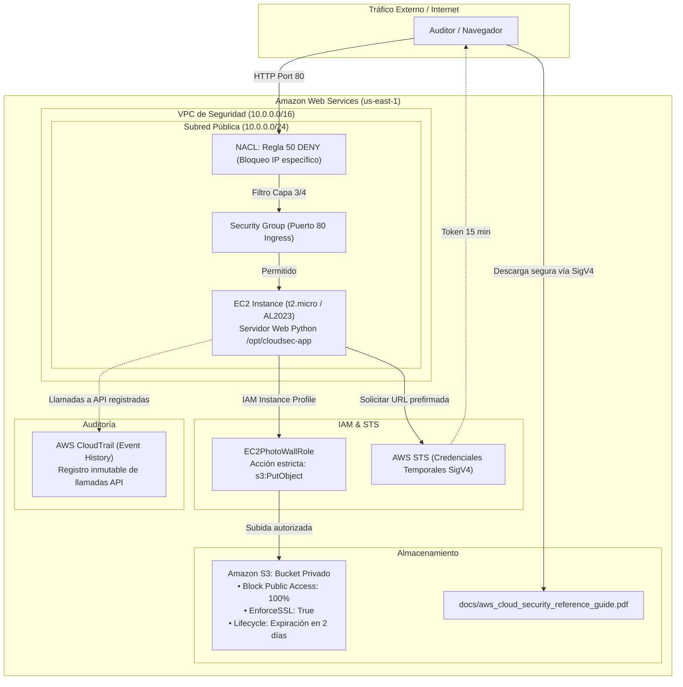

# AWS Cloud Security Lab

[](https://opensource.org/licenses/MIT)
[](https://aws.amazon.com/cdk/)
[](https://aws.amazon.com/free/)
[](https://docs.aws.amazon.com/IAM/latest/UserGuide/best-practices.html)

Laboratorio práctico desarrollado con **AWS CDK (TypeScript)** y Python para detectar, validar y mitigar los **4 puntos ciegos más comunes de seguridad en AWS**:

1. **IAM:** Principio de Menor Privilegio vs. Comodines Globales (`*`).
2. **Perímetro de Red:** Security Groups (*Stateful*) vs. Network ACLs (*Stateless Deny*).
3. **Almacenamiento:** Amazon S3 Block Public Access (BPA) y delegación temporal con **AWS STS SigV4**.
4. **Trazabilidad:** Auditoría e investigación forense de llamadas API en **AWS CloudTrail**.

Diseñado para desarrolladores, auditores de seguridad, estudiantes y arquitectos de soluciones que buscan experimentar con políticas de seguridad en la práctica real.

---

## Arquitectura del Laboratorio



---

## Compromiso de Costo Cero ($0 USD)

El laboratorio está diseñado bajo el **AWS Free Tier**:
- **Instancia EC2:** Utiliza tamaño `t2.micro` (dentro de las 750 horas mensuales gratuitas).
- **Amazon S3:** Capacidad estándar dentro de los primeros 5 GB y 20,000 peticiones GET. Incluye una regla de ciclo de vida (*Lifecycle Rule*) que elimina automáticamente los objetos de prueba tras 48 horas.
- **AWS CloudTrail:** La consulta de **Event History** (últimos 90 días de llamadas de administración) no tiene costo de almacenamiento.
- **Limpieza Automatizada:** Un solo comando destruye todos los recursos al finalizar.

---

## Requisitos Previos

- **AWS CLI** instalado y configurado con credenciales (`aws configure`).
- **Node.js** (v18 o superior) y **npm**.
- **Python 3.9+**.
- **AWS CDK v2** instalado globalmente (`npm install -g aws-cdk`).

Verifica tus herramientas:
```bash
aws --version
node --version
cdk --version
```

---

## Despliegue Rápido (En 5 Minutos)

### 1. Clonar el repositorio
```bash
git clone https://github.com/Siegfried-FS/aws-cloud-security-lab.git
cd aws-cloud-security-lab
```

### 2. Instalar dependencias del CDK
```bash
cd cdk
npm install
npm run build
cd ..
```

### 3. Desplegar con AWS CDK
```bash
cd cdk
npx cdk deploy --require-approval never
```
*Al concluir el despliegue, la terminal imprimirá la IP pública de la instancia EC2 y la URL del laboratorio:*
```text
Outputs:
CloudSecurityStack.WebServerUrl = http://XX.XX.XX.XX
CloudSecurityStack.S3BucketName = cloudsecuritystack-photogallerybucket-xxxx
```

---

## Los 4 Experimentos Prácticos

### Experimento 1: IAM Least Privilege (Menor Privilegio)
- **Problema:** Asignar `s3:*` sobre `*` permite que un atacante con acceso a la máquina borre o descargue cualquier bucket de la cuenta.
- **Prueba en Vivo:**
  1. Accede a la URL web del laboratorio.
  2. Sube un objeto de prueba. La política IAM `EC2PhotoWallRole` permite estrictamente `s3:PutObject` en el prefijo `galeria/*`.
  3. Intenta listar o borrar buckets desde la instancia sin autorización: el resultado será un `403 AccessDenied`.

### Experimento 2: Security Groups vs. Network ACLs
- **Problema:** Abrir el puerto 80/22 a `0.0.0.0/0` expone el servicio a escaneos globales automatizados.
- **Prueba en Vivo:**
  - **Security Group (Stateful):** Solo permite reglas `ALLOW`. Abre o cierra el puerto 80 y observa cómo el tráfico entrante responde en milisegundos.
  - **Network ACL (Stateless):** Agrega una regla `50 DENY` para una dirección IP específica. A diferencia del Security Group, la NACL descarta los paquetes antes de que alcancen la instancia.

### Experimento 3: Amazon S3 BPA y Delegación con AWS STS
- **Problema:** Hacer un bucket público para compartir archivos viola marcos de cumplimiento normativo (ISO 27001, SOC 2).
- **Prueba en Vivo:**
  1. Pulsa **"Petición Anónima Directa"**: Obtendrás un `403 Forbidden` porque **Block Public Access (BPA)** está forzado al 100%.
  2. Pulsa **"Descarga Segura (STS SigV4)"**: El servidor solicita un token temporal a AWS STS y genera una URL prefirmada con firma SigV4 válida por 15 minutos, descargando la guía sin comprometer la privacidad del bucket.

### Experimento 4: Trazabilidad Forense en CloudTrail
- **Problema:** Modificaciones en infraestructura sin auditoría impiden identificar vectores de ataque.
- **Prueba en Vivo:**
  Ejecuta el script de auditoría para consultar los eventos generados por tu IP y rol:
  ```bash
  ./scripts/ver_auditoria_cloudtrail.sh
  ```
  Observarás eventos como `PutObject`, `AuthorizeSecurityGroupIngress` o `RevokeSecurityGroupIngress`, con la IP origen exacta, la identidad IAM y la marca de tiempo.

---

## Destrucción Total y Garantía de $0 USD

Para evitar cualquier cargo residual en tu cuenta de AWS, destruye la infraestructura al concluir tus pruebas:

```bash
cd cdk
npx cdk destroy --force
```

El stack de CDK tiene configuradas políticas `RemovalPolicy.DESTROY` y `autoDeleteObjects: true`, por lo que el bucket S3, las políticas IAM, la instancia EC2 y la VPC se eliminarán de raíz.

---

## Estructura del Repositorio

```text
aws-cloud-security-lab/
├── cdk/                                # Infraestructura como Código (AWS CDK TypeScript)
│   ├── bin/app.ts                      # Punto de entrada de la aplicación CDK
│   ├── lib/cloud-security-stack.ts     # Definición de recursos (VPC, EC2, S3, IAM)
│   └── assets/
│       ├── server.py                   # Servidor web en Python para validación en vivo
│       └── sample-docs/                # Guía técnica de referencia en PDF para pruebas STS
│
├── scripts/                            # Herramientas de soporte
│   ├── cloudsec_wizard.py              # Asistente CLI interactivo en terminal
│   ├── deploy.sh                       # Despliegue directo automatizado
│   ├── destroy.sh                      # Destrucción directa total
│   └── ver_auditoria_cloudtrail.sh     # Consulta forense en AWS CloudTrail
│
├── videos/                             # Demostraciones y evidencias en video (MP4)
│   ├── 01_iam_politica_least_privilege_consola.mp4
│   ├── 02_iam_editor_visual_politicas.mp4
│   ├── 03_security_groups_advertencia_0.0.0.0_consola.mp4
│   ├── 04_s3_sts_presigned_url_descarga_sigv4.mp4
│   ├── 05_cloudtrail_auditoria_forense_ip_evento.mp4
│   ├── 06_ec2_asociar_modificar_iam_role_en_vivo.mp4
│   ├── 07_vpc_nacl_bloqueo_ip_especifica_deny.mp4
│   └── 08_purga_total_destruccion_cloudformation_cero_costo.mp4
│
└── README.md                           # Documentación técnica completa
```

---

## Licencia

Este proyecto está bajo la Licencia **MIT**. Eres libre de utilizarlo, modificarlo y compartirlo con tu comunidad técnica o grupo de estudio.
